# Data Pipeline with Apache Airflow

A python program that built data pipelines that are dynamic and built from reusable tasks, can be monitored, and allow easy backfills using Apache Airflow.  \
The client aims to to introduce more automation and monitoring to Sparkify's data warehouse ETL pipelines.

## Required libraries

1. airflow [https://airflow.apache.org]

### Installation

1. 'pip install airflow' to implement Python Apache Airflow

## Files

### DAGs

- dag.py : Main dag file 

### Sub DAGs

- subdag_stage.py : Drop, create and load staging tables
- subdag_load.py : Loads all fact and dimensional tables
- subdag_check.py : Perform data quality checks on all fact and dimensional tables

### SQL

- sql_create.py : SQL statments to drop and create tables
- sql_queries.py : SQL statements to insert data into tables
  
### Operators

- stage_redshift.py : Stage event and log tables from S3 to Redshift
- load_fact.py : Insert data into fact table
- load_dimensional.py: Insert data into dimensional tables
- data_quality.py : Run data quality checks on tables

## Running the tests

1. Start Apache Airflow
2. Open Apache Airflow web interface
3. On and trigger the DAG

# Data

The growing user base and song database of a music streaming startup, Sparkify. Their data resides in S3, in a directory of JSON logs on user activity on the app, as well as a directory with JSON metadata on the songs in their app.

- song_data (s3a://udacity-dend/song_data): Contains information of invdividual songs
- log_data (s3a://udacity-dend/log_data): Contains logs of user activity on Sparkify application

# Pipeline Overview

## Overall Flow of Data

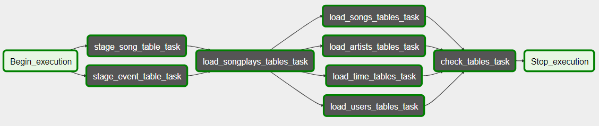

## Flow of data in subdag_stage.py

- staging_events table \
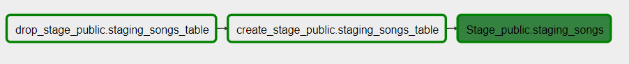 

- staging_songs table \
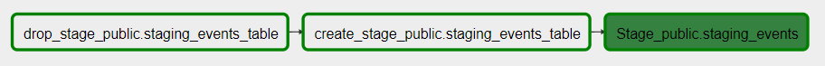

## Flow of data in subdag_load.py

- songplays table (Fact) \
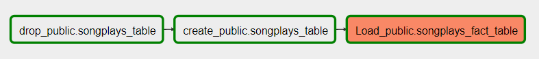

- songs table (Dimensional) \
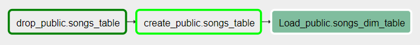

- artists table (Dimensional) \
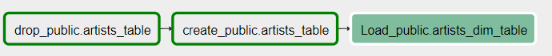

- users table (Dimensional) \
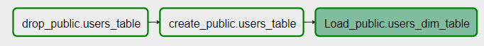

- time table (Dimensional) \
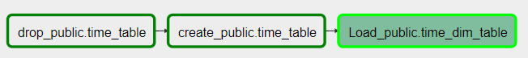

## Flow of data in subdag_check.py

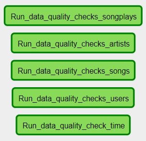

# Database Overview

## Staging Tables Schema

### staging_songs
root \
 |-- num_songs: integer (nullable = true) \
 |-- artist_id: string (nullable = true) \
 |-- artist_latitude: double (nullable = true) \
 |-- artist_longitude: double (nullable = true) \
 |-- artist_location: string (nullable = true) \
 |-- artist_name: string (nullable = true) \
 |-- song_id: string (nullable = true) \
 |-- title: string (nullable = true) \
 |-- duration: double (nullable = true) \
 |-- year: integer (nullable = true)

#### Sample:

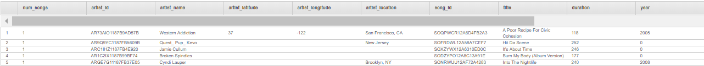

### staging_events

root \
 |-- artist: string (nullable = true) \
 |-- auth: string (nullable = true) \
 |-- firstName: string (nullable = true) \
 |-- gender: string (nullable = true) \
 |-- itemInSession: integer (nullable = true) \
 |-- lastName: string (nullable = true) \
 |-- length: double (nullable = true) \
 |-- level: string (nullable = true) \
 |-- location: string (nullable = true) \
 |-- method: string (nullable = true) \
 |-- page: string (nullable = true) \
 |-- registration: double (nullable = true) \
 |-- sessionId: integer (nullable = true) \
 |-- song: string (nullable = true) \
 |-- status: integer (nullable = true) \
 |-- ts: string (nullable = true) \
 |-- userAgent: string (nullable = true) \
 |-- userId: integer (nullable = true)

#### Sample:

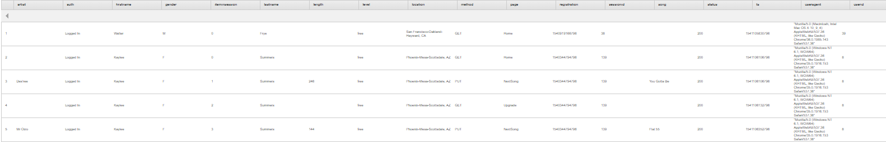

## Fact Table

### songplays_table

root \
 |-- songplay_id: int (nullable = true) \
 |-- start_time: long (nullable = true) \
 |-- userid: string (nullable = true) \
 |-- level: string (nullable = true) \
 |-- song_id: string (nullable = true) \
 |-- artist_id: string (nullable = true) \
 |-- sessionid: integer (nullable = true) \
 |-- location: string (nullable = true) \
 |-- useragent: string (nullable = true)
 
#### Sample:

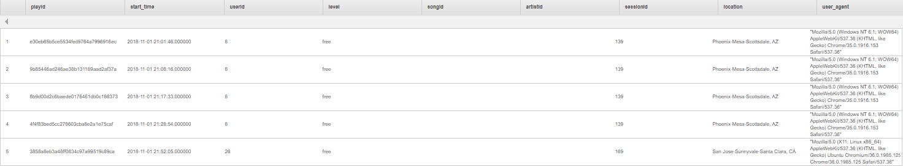

## Dimensional Tables

### songs_table

root \
 |-- song_id: string (nullable = true) \
 |-- title: string (nullable = true) \
 |-- artist_id: string (nullable = true) \
 |-- year: integer (nullable = true) \
 |-- duration: double (nullable = true)

#### Sample:

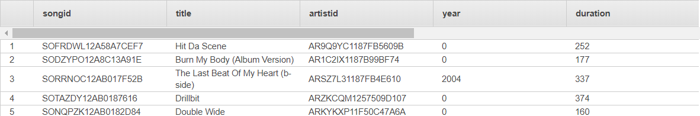

### artists_table

root \
 |-- artist_id: string (nullable = true) \
 |-- artist_name: string (nullable = true) \
 |-- artist_location: string (nullable = true) \
 |-- artist_latitude: double (nullable = true) \
 |-- artist_longitude: double (nullable = true)

#### Sample:

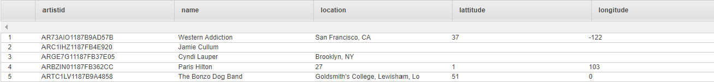

### users_table

root    \
 |-- userid: integer (nullable = true) \
 |-- firstname: string (nullable = true) \
 |-- lastname: string (nullable = true) \
 |-- gender: string (nullable = true) \
 |-- level: string (nullable = true) \

#### Sample:

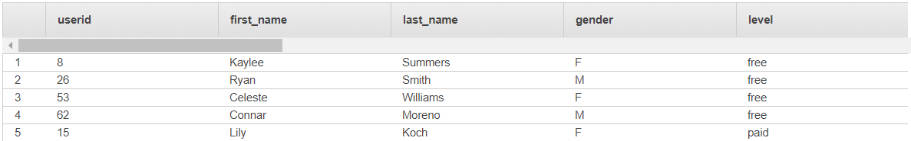

### time_table

root \
 |-- timestamp: string (nullable = true) \
 |-- hour: integer (nullable = true) \
 |-- day: integer (nullable = true) \
 |-- week: integer (nullable = true) \
 |-- month: integer (nullable = true) \
 |-- year: integer (nullable = true) \
 |-- weekday: string (nullable = true)

#### Sample:

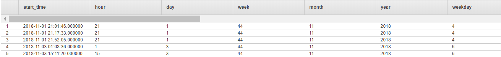

# Project Overview

## Built with

[Amazon S3](https://aws.amazon.com/S3/) - Data used \
[Amazon Redshift](https://aws.amazon.com/redshift/) - Data used \
[Apache Airflow](https://airflow.apache.org) - Data processing pipeline
[Python](https://www.python.org/) - Programming language \

## Authors

**Jobelle Lee** - [themaxermister](https://github.com/themaxermister/data-pipelines)
